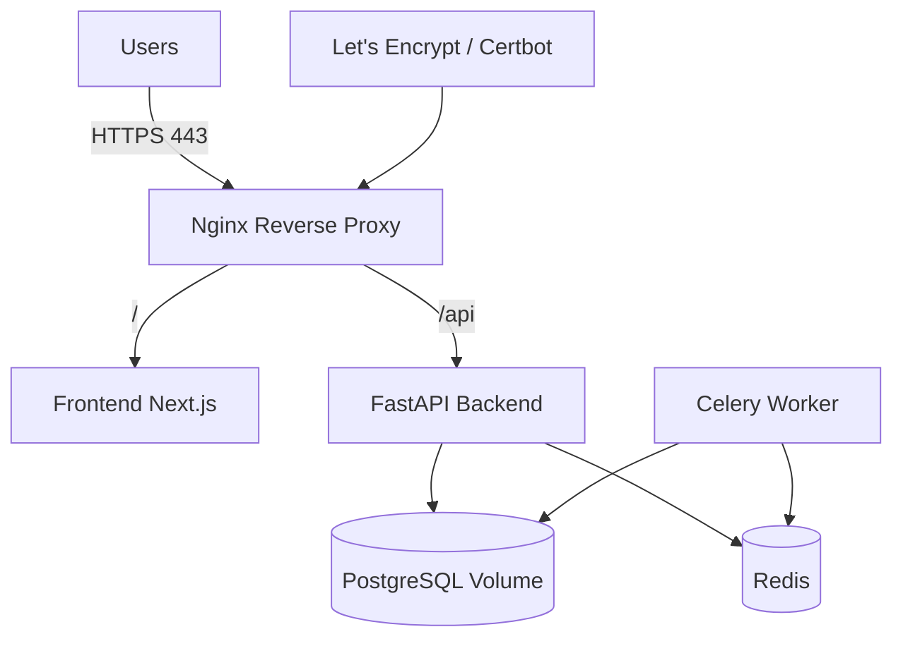

# Production Deployment Guide

## Artifacts
- `deploy.sh`: interactive first-time production installer.
- `update.sh`: rolling update utility.
- `uninstall.sh`: removes deployed stack and generated runtime assets.
- `docker-compose.prod.yml`: production service topology.

## System architecture diagram



## First-time deployment

```bash
chmod +x deploy.sh update.sh uninstall.sh
./deploy.sh
```

The script performs:
1. OS detection and package installation (Docker, Compose, Git, Nginx, Certbot, UFW).
2. Environment validation (ports, DNS, Docker status, memory).
3. Interactive prompts for critical production inputs.
4. Auto generation of `.env`, Docker secrets, and random credentials.
5. SSL provisioning and firewall hardening.
6. Container bootstrap and post-deploy verification.
7. Rollback to previous state when any critical step fails.

## Updating

```bash
./update.sh
```

This rebuilds/restarts the stack and verifies frontend, backend health, and database connectivity.

## Uninstall

```bash
./uninstall.sh
```

Stops containers, removes volumes, and optionally deletes runtime assets (`.env`, secrets, SSL artifacts).

## Operational recommendations
- Put `.env` and `deploy/secrets/*` into a secret manager after deployment.
- Schedule DB snapshots for volume `postgres_data`.
- Enable log shipping and uptime monitoring.
- Rotate OpenAI, Redis, DB, and JWT secrets quarterly.
